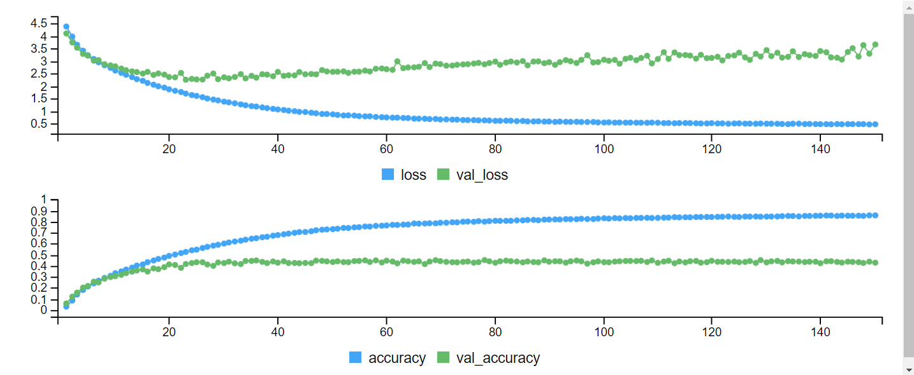
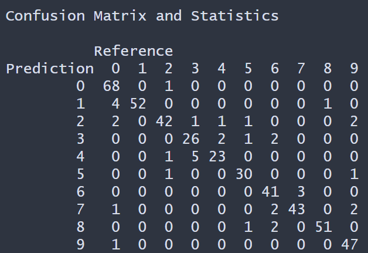
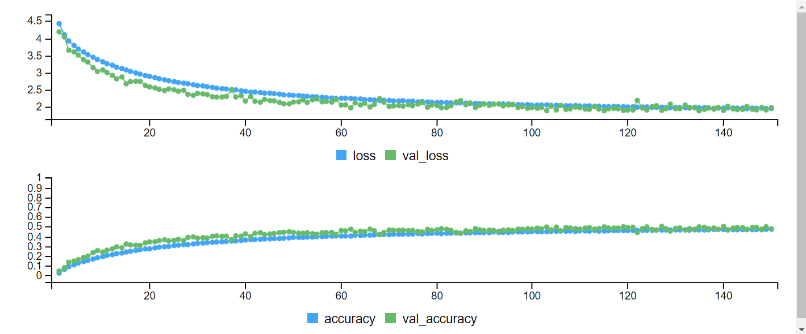
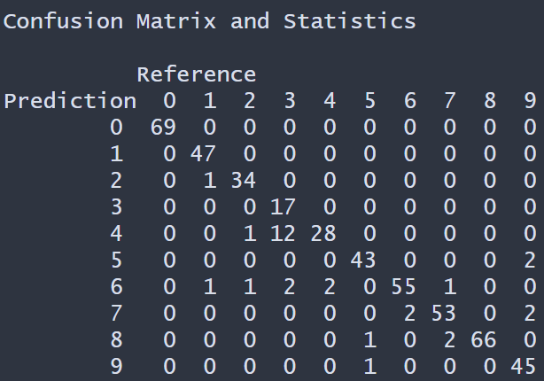

# Convolutional Neural Network

Used Convolutional Neural Network (CNN) for classifying images from the`CIFAR100` database. The data set contains 60,000 images with the corresponding label. There are a total of 100 classes. The images have a resolution of 32 X 32 pixels and three eight-bit number to represent red, green, and blue. The data is a 3 dimensional array, where the first two axes are spatial (32 X 32 pixels), and the third represent the color. The data is split 50,000 for training/validation sets and 10,000 for testing set. 

The first model  used for classifying the images is the CNN model. The second was CNN model with data augmentation which basically replicates and distorted the images in different way. Such as rotation, zooming, flipping, width, and height to name a few. The reason for data augmentation is to help prevent overfitting.

### Results

The figure below show the training and validation accuracy and loss function for CNN model. The CNN model was used on the test set of 10,000 images. The overall accuracy is about 0.453 with a 95% CI between (0.4428, 0.4624) in classifying the 100 classes (unique images). 

The table below shows the prediction and reference for the first 9 classes. 

For the CNN data augmentation model the overall accuracy is about 0.475 with a 95% CI between 0.4654 and  0.485 in classifying the 100 classes . 

The figure below show the training and validation accuracy and loss function and the prediction and reference for the first 9 classes CNN model with data augmentation.

## Conclusion 

CNN model with data augmentation accuracy improve to classify the 100 unique classes. The 95% CI of accuracy is between 0.4654 and  0.485 thus there is room for improvement in the Neural Network to improve the classification model. 

